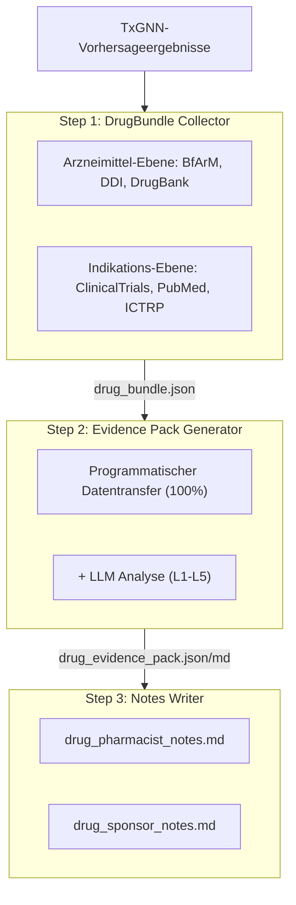
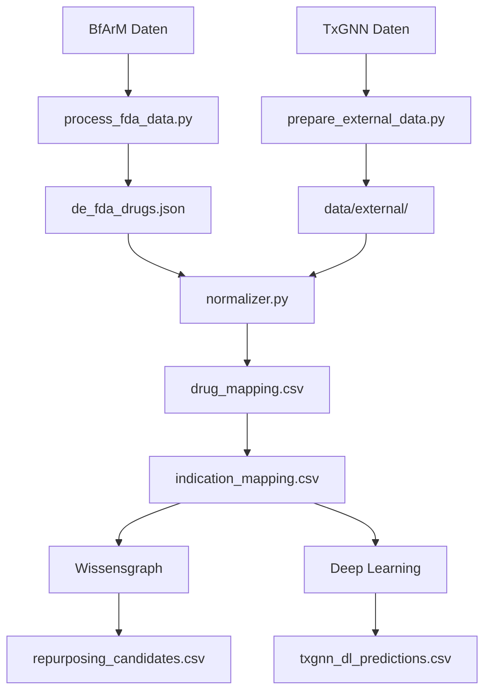

# DETxGNN - Deutschland: Arzneimittel-Repositionierung

[](https://detxgnn.yao.care)
[](https://opensource.org/licenses/MIT)

Vorhersagen zur Arzneimittel-Repositionierung fuer Germany BfArM-zugelassene Arzneimittel mit dem TxGNN-Modell.

## Haftungsausschluss

- Die Ergebnisse dieses Projekts dienen ausschliesslich zu Forschungszwecken und stellen keine medizinische Beratung dar.
- Kandidaten fuer die Arzneimittel-Repositionierung erfordern eine klinische Validierung vor der Anwendung.

## Projektuebersicht

### Berichtsstatistiken

| Element | Anzahl |
|------|------|
| **Arzneimittelberichte** | 488 |
| **Gesamtvorhersagen** | 2,810,877 |
| **Einzigartige Arzneimittel** | 691 |
| **Einzigartige Indikationen** | 17,041 |
| **DDI-Daten** | 302,516 |
| **DFI-Daten** | 857 |
| **DHI-Daten** | 35 |
| **DDSI-Daten** | 8,359 |
| **FHIR-Ressourcen** | 488 MK / 2,763 CUD |

### Verteilung der Evidenzstufen

| Evidenzstufe | Berichtsanzahl | Beschreibung |
|---------|-------|------|
| **L1** | 0 | Mehrere Phase-3-RCTs |
| **L2** | 0 | Einzelne RCT oder mehrere Phase-2-Studien |
| **L3** | 0 | Beobachtungsstudien |
| **L4** | 0 | Praeklinische / mechanistische Studien |
| **L5** | 488 | Nur computationale Vorhersage |

### Nach Quelle

| Quelle | Vorhersagen |
|------|------|
| DL | 2,808,114 |
| KG + DL | 2,474 |
| KG | 289 |

### Nach Vertrauen

| Vertrauen | Vorhersagen |
|------|------|
| very_high | 1,920 |
| high | 128,844 |
| medium | 258,174 |
| low | 2,421,939 |

---

## Vorhersagemethoden

| Methode | Geschwindigkeit | Genauigkeit | Anforderungen |
|------|------|--------|----------|
| Wissensgraph | Schnell (Sekunden) | Niedriger | Keine besonderen Anforderungen |
| Deep Learning | Langsam (Stunden) | Hoeher | Conda + PyTorch + DGL |

### Wissensgraph-Methode

```bash
uv run python scripts/run_kg_prediction.py
```

| Metrik | Wert |
|------|------|
| BfArM Gesamtarzneimittel | 2,309 |
| DrugBank-Zuordnung | 1,458 (63.1%) |
| Repositionierungskandidaten | 2,763 |

### Deep-Learning-Methode

```bash
conda activate txgnn
PYTHONPATH=src python -m detxgnn.predict.txgnn_model
```

| Metrik | Wert |
|------|------|
| DL-Gesamtvorhersagen | 1,599,614 |
| Einzigartige Arzneimittel | 691 |
| Einzigartige Indikationen | 17,041 |

### Score-Interpretation

Der TxGNN-Score repraesentiert das Vertrauen des Modells in ein Arzneimittel-Krankheits-Paar im Bereich von 0 bis 1.

| Schwellenwert | Bedeutung |
|-----|------|
| >= 0.9 | Sehr hohes Vertrauen |
| >= 0.7 | Hohes Vertrauen |
| >= 0.5 | Mittleres Vertrauen |

#### Score-Verteilung

| Schwellenwert | Bedeutung |
|-----|------|
| ≥ 0.9999 | Extrem hohes Vertrauen, sicherste Vorhersagen des Modells |
| ≥ 0.99 | Sehr hohes Vertrauen, Priorisierung fuer Validierung empfohlen |
| ≥ 0.9 | Hohes Vertrauen |
| ≥ 0.5 | Moderates Vertrauen (Sigmoid-Entscheidungsgrenze) |

#### Definitionen der Evidenzstufen

| Stufe | Definition | Klinische Bedeutung |
|-----|------|---------|
| L1 | Phase-3-RCT oder systematische Uebersicht | Kann klinische Anwendung unterstuetzen |
| L2 | Phase-2-RCT | Kann fuer die Anwendung in Betracht gezogen werden |
| L3 | Phase-1- oder Beobachtungsstudie | Erfordert weitere Bewertung |
| L4 | Fallbericht oder praeklinische Forschung | Noch nicht empfohlen |
| L5 | Nur computergestuetzte Vorhersage, keine klinische Evidenz | Erfordert weitere Forschung |

#### Wichtige Hinweise

1. **Hohe Scores garantieren keine klinische Wirksamkeit: TxGNN-Scores sind wissensgrafikbasierte Vorhersagen, die eine klinische Validierung erfordern.**
2. **Niedrige Scores bedeuten nicht unwirksam: Das Modell hat moeglicherweise bestimmte Zusammenhaenge nicht gelernt.**
3. **Empfohlen mit Validierungspipeline zu verwenden: Nutzen Sie die Werkzeuge dieses Projekts zur Ueberpruefung klinischer Studien, Literatur und anderer Evidenz.**

### Validierungspipeline



---

## Schnellstart

### Schritt 1: Daten herunterladen

| Datei | Download |
|------|------|
| BfArM Daten | [EMA Medicines Data (proxy for German-authorized medicines)](https://www.ema.europa.eu/en/medicines/download-medicine-data) |
| node.csv | [Harvard Dataverse](https://dataverse.harvard.edu/api/access/datafile/7144482) |
| kg.csv | [Harvard Dataverse](https://dataverse.harvard.edu/api/access/datafile/7144484) |
| edges.csv | [Harvard Dataverse](https://dataverse.harvard.edu/api/access/datafile/7144483) |
| model_ckpt.zip | [Google Drive](https://drive.google.com/uc?id=1fxTFkjo2jvmz9k6vesDbCeucQjGRojLj) |

### Schritt 2: Abhaengigkeiten installieren

```bash
uv sync
```

### Schritt 3: Arzneimitteldaten verarbeiten

```bash
uv run python scripts/process_fda_data.py
```

### Schritt 4: Vokabeldaten vorbereiten

```bash
uv run python scripts/prepare_external_data.py
```

### Schritt 5: Wissensgraph-Vorhersage ausfuehren

```bash
uv run python scripts/run_kg_prediction.py
```

### Schritt 6: Deep-Learning-Umgebung einrichten

```bash
conda create -n txgnn python=3.11 -y
conda activate txgnn
pip install torch==2.2.2 torchvision==0.17.2
pip install dgl==1.1.3
pip install git+https://github.com/mims-harvard/TxGNN.git
pip install pandas tqdm pyyaml pydantic ogb
```

### Schritt 7: Deep-Learning-Vorhersage ausfuehren

```bash
conda activate txgnn
PYTHONPATH=src python -m detxgnn.predict.txgnn_model
```

---

## Ressourcen

### TxGNN Kern

- [TxGNN Paper](https://www.nature.com/articles/s41591-024-03233-x) - Nature Medicine, 2024
- [TxGNN GitHub](https://github.com/mims-harvard/TxGNN)
- [TxGNN Explorer](http://txgnn.org)

### Datenquellen

| Kategorie | Daten | Quelle | Hinweis |
|------|------|------|------|
| **Arzneimitteldaten** | BfArM | [EMA Medicines Data (proxy for German-authorized medicines)](https://www.ema.europa.eu/en/medicines/download-medicine-data) | Germany |
| **Wissensgraph** | TxGNN KG | [Harvard Dataverse](https://dataverse.harvard.edu/dataset.xhtml?persistentId=doi:10.7910/DVN/IXA7BM) | 17,080 diseases, 7,957 drugs |
| **Arzneimitteldatenbank** | DrugBank | [DrugBank](https://go.drugbank.com/) | Wirkstoffzuordnung |
| **Arzneimittelinteraktionen** | DDInter 2.0 | [DDInter](https://ddinter2.scbdd.com/) | DDI-Paare |
| **Arzneimittelinteraktionen** | Guide to PHARMACOLOGY | [IUPHAR/BPS](https://www.guidetopharmacology.org/) | Zugelassene Arzneimittelinteraktionen |
| **Klinische Studien** | ClinicalTrials.gov | [CT.gov API v2](https://clinicaltrials.gov/data-api/api) | Register klinischer Studien |
| **Klinische Studien** | WHO ICTRP | [ICTRP API](https://apps.who.int/trialsearch/api/v1/search) | Internationale Plattform klinischer Studien |
| **Literatur** | PubMed | [NCBI E-utilities](https://eutils.ncbi.nlm.nih.gov/entrez/eutils/) | Medizinische Literatursuche |
| **Namenszuordnung** | RxNorm | [RxNav API](https://rxnav.nlm.nih.gov/REST) | Arzneimittelnamen-Standardisierung |
| **Namenszuordnung** | PubChem | [PUG-REST API](https://pubchem.ncbi.nlm.nih.gov/docs/pug-rest) | Chemische Substanz-Synonyme |
| **Namenszuordnung** | ChEMBL | [ChEMBL API](https://www.ebi.ac.uk/chembl/api/data) | Bioaktivitaets-Datenbank |
| **Standards** | FHIR R4 | [HL7 FHIR](http://hl7.org/fhir/) | MedicationKnowledge, ClinicalUseDefinition |
| **Standards** | SMART on FHIR | [SMART Health IT](https://smarthealthit.org/) | EHR-Integration, OAuth 2.0 + PKCE |

### Modell-Downloads

| Datei | Download | Hinweis |
|------|------|------|
| Vortrainiertes Modell | [Google Drive](https://drive.google.com/uc?id=1fxTFkjo2jvmz9k6vesDbCeucQjGRojLj) | model_ckpt.zip |
| node.csv | [Harvard Dataverse](https://dataverse.harvard.edu/api/access/datafile/7144482) | Knotendaten |
| kg.csv | [Harvard Dataverse](https://dataverse.harvard.edu/api/access/datafile/7144484) | Wissensgraph-Daten |
| edges.csv | [Harvard Dataverse](https://dataverse.harvard.edu/api/access/datafile/7144483) | Kantendaten (DL) |

## Projektvorstellung

### Verzeichnisstruktur

```
DETxGNN/
├── README.md
├── CLAUDE.md
├── pyproject.toml
│
├── config/
│   └── fields.yaml
│
├── data/
│   ├── kg.csv
│   ├── node.csv
│   ├── edges.csv
│   ├── raw/
│   ├── external/
│   ├── processed/
│   │   ├── drug_mapping.csv
│   │   ├── repurposing_candidates.csv
│   │   ├── txgnn_dl_predictions.csv.gz
│   │   └── integration_stats.json
│   ├── bundles/
│   └── collected/
│
├── src/detxgnn/
│   ├── data/
│   │   └── loader.py
│   ├── mapping/
│   │   ├── normalizer.py
│   │   ├── drugbank_mapper.py
│   │   └── disease_mapper.py
│   ├── predict/
│   │   ├── repurposing.py
│   │   └── txgnn_model.py
│   ├── collectors/
│   └── paths.py
│
├── scripts/
│   ├── process_fda_data.py
│   ├── prepare_external_data.py
│   ├── run_kg_prediction.py
│   └── integrate_predictions.py
│
├── docs/
│   ├── _drugs/
│   ├── fhir/
│   │   ├── MedicationKnowledge/
│   │   └── ClinicalUseDefinition/
│   └── smart/
│
├── model_ckpt/
└── tests/
```

**Legende**: 🔵 Projektentwicklung | 🟢 Lokale Daten | 🟡 TxGNN-Daten | 🟠 Validierungspipeline

### Datenfluss



---

## Zitierung

Wenn Sie diesen Datensatz oder diese Software verwenden, zitieren Sie bitte:

```bibtex
@software{detxgnn2026,
  author       = {Yao.Care},
  title        = {DETxGNN: Drug Repurposing Validation Reports for Germany BfArM Drugs},
  year         = 2026,
  publisher    = {GitHub},
  url          = {https://github.com/yao-care/DETxGNN}
}
```

Zitieren Sie auch die urspruengliche TxGNN-Publikation:

```bibtex
@article{huang2023txgnn,
  title={A foundation model for clinician-centered drug repurposing},
  author={Huang, Kexin and Chandak, Payal and Wang, Qianwen and Haber, Shreyas and Zitnik, Marinka},
  journal={Nature Medicine},
  year={2023},
  doi={10.1038/s41591-023-02233-x}
}
```
